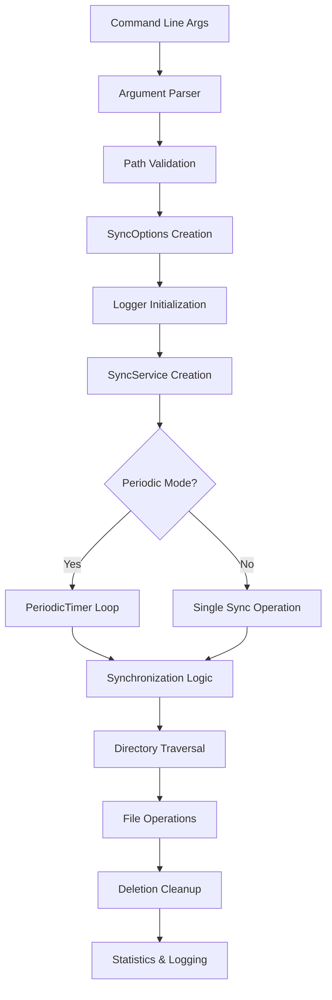

# FolderSync - Technical Documentation

> Developer documentation for the FolderSync application architecture, implementation details, and contribution guidelines.

## Table of Contents
- [Project Structure](#project-structure)
- [Architecture Overview](#architecture-overview)
- [Core Components](#core-components)
- [Algorithms & Implementation](#algorithms--implementation)
- [Development Process](#development-process)
- [Testing Strategy](#testing-strategy)
- [Build & Deployment](#build--deployment)
- [Contributing](#contributing)

## Project Structure

```
C:\Projects\FileSynchroniser\
├── FolderSync.sln                    # Visual Studio solution file
├── README.md                         # User documentation
├── README-TECHNICAL.md               # This technical documentation
│
├── FolderSync\                       # Main application project
│   ├── FolderSync.csproj            # Project file with dependencies
│   ├── Program.cs                   # Entry point & CLI handling
│   ├── SyncService.cs               # Core synchronization logic
│   ├── Logger.cs                    # Thread-safe logging implementation
│   │
│   ├── Models\                      # Data models and DTOs
│   │   ├── SyncOptions.cs           # Configuration options container
│   │   └── SyncStats.cs             # Operation statistics tracking
│   │
│   └── Utilities\                   # Helper classes and utilities
│       └── PathHelper.cs            # Cross-platform path operations
│
└── FolderSync.Tests\                # Unit test project
    ├── FolderSync.Tests.csproj      # Test project configuration
    └── UnitTest1.cs                 # Comprehensive test suite
```

## Architecture Overview

### Design Principles

**1. Separation of Concerns**
- CLI parsing separated from business logic
- Logging abstracted from sync operations
- File operations isolated in service layer

**2. Testability**
- Dependency injection for logger
- Mockable interfaces for testing
- Isolated test environments with cleanup

**3. Error Resilience**
- Graceful degradation on individual file failures
- Comprehensive error logging
- Continuation of operations despite partial failures

**4. Performance Optimization**
- Iterative traversal to avoid stack overflow
- Efficient memory usage with `Directory.Enumerate*`
- Optional expensive operations (MD5) only when requested

### System Flow



## Core Components

### 1. Program.cs - Entry Point & CLI

**Responsibilities:**
- Command-line argument parsing with validation
- Path normalization and directory creation
- Graceful shutdown handling (Ctrl+C)
- Error handling and exit codes

**Key Features:**
```csharp
// Custom CLI parser supporting short aliases
case "--source" or "-s":
case "--replica" or "-r":
case "--interval" or "-i":

// Comprehensive path validation
options.SourcePath = Path.GetFullPath(options.SourcePath);
options.ReplicaPath = Path.GetFullPath(options.ReplicaPath);

// Graceful shutdown with cancellation token
Console.CancelKeyPress += (sender, e) => {
    e.Cancel = true;
    cts.Cancel();
};
```

### 2. SyncService.cs - Core Synchronization Engine

**Architecture Pattern:** Service Layer with Iterative Processing

**Key Algorithms:**

**Stack-Based Directory Traversal:**
```csharp
private void SynchronizeDirectoryIterative(string sourcePath, string replicaPath, SyncStats stats, bool useMd5)
{
    var directoriesToProcess = new Stack<(string source, string replica)>();
    directoriesToProcess.Push((sourcePath, replicaPath));
    
    while (directoriesToProcess.Count > 0)
    {
        var (currentSource, currentReplica) = directoriesToProcess.Pop();
        // Process files and subdirectories...
    }
}
```

**Benefits:**
- Prevents stack overflow on deep directory structures
- Consistent memory usage regardless of directory depth
- Easy to debug and modify traversal logic

**File Comparison Strategy:**
```csharp
// Dual-mode comparison for performance vs accuracy
private bool ShouldCopyFile(string sourceFile, string replicaFile, bool useMd5)
{
    // Fast comparison first
    bool sizeOrTimeChanged = sourceInfo.Length != replicaInfo.Length ||
                           sourceInfo.LastWriteTime != replicaInfo.LastWriteTime;
    
    // Optional deep comparison
    if (useMd5 && !sizeOrTimeChanged)
    {
        return !FilesHaveSameMd5Hash(sourceFile, replicaFile);
    }
    
    return sizeOrTimeChanged;
}
```

**Deletion Strategy:**
- Two-phase deletion: files first, then empty directories
- Recursive cleanup of orphaned directory structures
- Error isolation to prevent cascade failures

### 3. Logger.cs - Thread-Safe Logging

**Design Pattern:** Singleton-like service with thread safety

**Features:**
```csharp
private readonly object _lockObject = new object();

private void LogMessage(string level, string message)
{
    var logEntry = $"[{DateTime.Now:yyyy-MM-dd HH:mm:ss}] {level}: {message}";
    
    lock (_lockObject)
    {
        Console.WriteLine(logEntry);
        File.AppendAllText(_logFilePath, logEntry + Environment.NewLine);
    }
}
```

**Thread Safety:** Uses lock-based synchronization for concurrent access
**Output Targets:** Dual output to both console and file simultaneously
**Error Handling:** Graceful degradation if file logging fails

### 4. Models - Data Structures

**SyncOptions.cs:**
```csharp
public class SyncOptions
{
    public required string SourcePath { get; set; }
    public required string ReplicaPath { get; set; }
    public int IntervalSeconds { get; set; } = 0;
    public string LogPath { get; set; } = "sync.log";
    public bool UseMd5Verification { get; set; } = false;
}
```

**SyncStats.cs:**
```csharp
public class SyncStats
{
    public int FilesCopied { get; set; } = 0;
    public int FilesUpdated { get; set; } = 0;
    public int FilesDeleted { get; set; } = 0;
    public int DirectoriesCreated { get; set; } = 0;
    public int DirectoriesDeleted { get; set; } = 0;
    public int ErrorsEncountered { get; set; } = 0;
}
```

## Algorithms & Implementation

### Directory Traversal Algorithm

**Problem:** Avoid recursion to prevent stack overflow on deep directories
**Solution:** Stack-based Depth-First Search (DFS)

```csharp
Algorithm: Iterative Directory Traversal
Input: sourcePath, replicaPath
Output: Synchronized replica directory

1. Initialize stack with (sourcePath, replicaPath)
2. While stack is not empty:
   a. Pop (currentSource, currentReplica) from stack
   b. Process all files in currentSource directory
   c. For each subdirectory in currentSource:
      - Create corresponding directory in replica if needed
      - Push (sourceSubDir, replicaSubDir) onto stack
3. Perform deletion cleanup in separate phase
```

**Time Complexity:** O(n) where n is total number of files and directories
**Space Complexity:** O(d) where d is maximum directory depth

### File Comparison Algorithm

**Standard Mode (Fast):**
```csharp
bool ShouldCopy = (source.Size != replica.Size) || 
                  (source.LastWrite != replica.LastWrite)
```

**MD5 Mode (Accurate):**
```csharp
if (!StandardModeIndicatesChange)
{
    bool ShouldCopy = MD5(source) != MD5(replica)
}
```

**Performance Trade-off:**
- Standard: ~1ms per file comparison
- MD5: ~10-100ms per file depending on size

### Deletion Algorithm

**Two-Phase Approach:**
1. **File Deletion Phase:** Remove orphaned files from replica
2. **Directory Deletion Phase:** Remove empty directories bottom-up

```csharp
Phase 1: File Deletion (Stack-based traversal)
- For each directory in replica:
  - Check if corresponding source directory exists
  - If exists, check each file against source
  - Delete files that don't exist in source

Phase 2: Directory Deletion (Recursive cleanup)
- For each directory in replica:
  - If corresponding source directory doesn't exist:
    - Delete entire directory tree
  - Else recursively check subdirectories
```

## Development Process

### Code Quality Standards

**Error Handling:**
```csharp
try
{
    // File operation
}
catch (Exception ex)
{
    _logger.LogError($"Specific operation failed: {ex.Message}");
    stats.ErrorsEncountered++;
    // Continue with next operation
}
```

**Resource Management:**
```csharp
using var md5 = MD5.Create();
using var stream = File.OpenRead(filePath);
// Automatic disposal
```

**Async/Await Pattern:**
```csharp
public async Task<SyncStats> SynchronizeAsync(string source, string replica, bool useMd5 = false)
{
    return await Task.Run(() => SynchronizeOnce(source, replica, useMd5));
}
```

## Testing Strategy

### Test Architecture

**Isolation Strategy:**
- Each test creates its own temporary directory
- Automatic cleanup in `Dispose()` method
- No shared state between tests

**Test Categories:**
1. **Functional Tests:** Core sync behaviors
2. **Edge Case Tests:** Read-only files, permission issues
3. **Integration Tests:** End-to-end scenarios
4. **Performance Tests:** Large file/directory handling

### Test Implementation

**Example Test Structure:**
```csharp
[Fact]
public async Task Sync_Should_Copy_NewFile_To_Replica()
{
    // Arrange - Set up test data
    var sourceFile = Path.Combine(_sourceDir, "newfile.txt");
    await File.WriteAllTextAsync(sourceFile, "Test content");

    // Act - Execute the operation
    var stats = await _syncService.SynchronizeAsync(_sourceDir, _replicaDir);

    // Assert - Verify results
    Assert.True(File.Exists(replicaFile));
    Assert.Equal("Test content", await File.ReadAllTextAsync(replicaFile));
    Assert.Equal(1, stats.FilesCopied);
}
```

**Test Coverage:**
- ✅ New file synchronization
- ✅ File modification detection and updates
- ✅ File and directory deletion
- ✅ Read-only file handling
- ✅ Nested directory structure creation
- ✅ MD5 verification accuracy
- ✅ Error handling and recovery

### Running Tests

```bash
# Run all tests
dotnet test

# Run with detailed output
dotnet test --verbosity normal

# Run specific test
dotnet test --filter "Name~NewFile"
```

## Build & Deployment

### Dependencies

```xml
<Project Sdk="Microsoft.NET.Sdk">
  <PropertyGroup>
    <OutputType>Exe</OutputType>
    <TargetFramework>net9.0</TargetFramework>
    <ImplicitUsings>enable</ImplicitUsings>
    <Nullable>enable</Nullable>
  </PropertyGroup>
</Project>
```

**Key Features:**
- .NET 9.0 target framework
- Nullable reference types enabled
- No external dependencies (uses only .NET BCL)

### Build Commands

```bash
# Development build
dotnet build

# Release build
dotnet build --configuration Release

# Publish for deployment
dotnet publish --configuration Release --output ./publish

# Run from source
dotnet run -- --source "C:\Source" --replica "D:\Replica"
```

### Cross-Platform Considerations

**Path Handling:**
```csharp
// Always use Path.Combine for cross-platform compatibility
var combinedPath = Path.Combine(directory, filename);

// Normalize paths
var normalizedPath = Path.GetFullPath(userPath);
```

**Platform-Specific Behaviors:**
- Windows: Handles drive letters, UNC paths, long path support
- Linux/macOS: Proper permission handling, case-sensitive filesystems
- All platforms: Unicode filename support

## Contributing

### Development Setup

1. **Prerequisites:**
   - .NET 9.0 SDK
   - Visual Studio 2022 or VS Code
   - Git

2. **Clone and Setup:**
   ```bash
   git clone <repository-url>
   cd FolderSync
   dotnet restore
   dotnet build
   ```

3. **Run Tests:**
   ```bash
   cd FolderSync.Tests
   dotnet test
   ```

### Code Style Guidelines

**Naming Conventions:**
- Classes: PascalCase (`SyncService`)
- Methods: PascalCase (`SynchronizeAsync`)
- Variables: camelCase (`sourceFile`)
- Constants: PascalCase (`DefaultLogPath`)

**Documentation:**
- XML documentation for all public members
- Inline comments for complex algorithms
- README updates for new features

**Error Handling:**
- Specific exception types where appropriate
- Comprehensive logging of errors
- Graceful degradation, never crash on file errors

### Pull Request Process

1. Create feature branch from main
2. Implement changes with tests
3. Ensure all tests pass
4. Update documentation
5. Submit PR with clear description

### Performance Guidelines

**File Operations:**
- Use `Directory.Enumerate*` instead of `Directory.Get*`
- Implement proper `using` statements for disposables
- Avoid loading entire files into memory unnecessarily

**Memory Management:**
- Dispose of streams and crypto objects properly
- Use iterative algorithms instead of recursive
- Monitor memory usage in tests

**Logging:**
- Use appropriate log levels
- Avoid excessive logging in tight loops
- Include relevant context in error messages

## Advanced Topics

### Extending File Comparison

To add custom file comparison logic:

```csharp
private bool ShouldCopyFile(string sourceFile, string replicaFile, bool useMd5)
{
    // Add custom comparison logic here
    // Examples: CRC32, SHA256, content-specific comparisons
}
```

### Adding New CLI Options

1. Update `SyncOptions.cs` with new property
2. Add parsing logic in `Program.cs`
3. Update help text in `ShowUsage()`
4. Add validation in `ValidateOptions()`
5. Implement functionality in `SyncService.cs`

### Performance Monitoring

Add performance tracking:

```csharp
var stopwatch = Stopwatch.StartNew();
// Perform operation
stopwatch.Stop();
_logger.LogInfo($"Operation took {stopwatch.ElapsedMilliseconds}ms");
```

### Custom Logging Backends

Extend logging to support different outputs:

```csharp
public interface ILogger
{
    void LogInfo(string message);
    void LogError(string message);
    void LogWarning(string message);
}

// Implement for different backends: file, database, network, etc.
```

---

*This technical documentation is maintained alongside the codebase. Please update when making significant architectural changes.*
